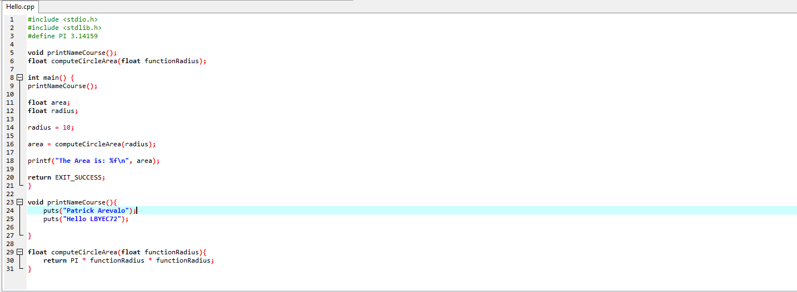
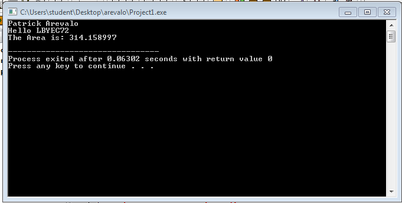

# LBYEC72-Practice

```c
#include <stdio.h>
#include <stdlib.h>
#define PI 3.14159

void printNameCourse();                                                                                      
float computeCircleArea(float functionRadius);

int main() {
printNameCourse();	

float area;
float radius;

radius = 10;

area = computeCircleArea(radius);

printf("The Area is: %f\n", area);

return EXIT_SUCCESS;
}

void printNameCourse(){
	puts("Patrick Arevalo");
	puts("Hello LBYEC72");
	
}

float computeCircleArea(float functionRadius){
	return PI * functionRadius * functionRadius;
}
```




